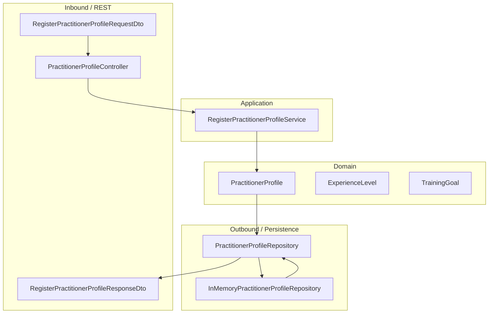

# Workout Engine

Workout Engine is a learning project for building a real backend with Java and Micronaut using Hexagonal Architecture and Clean Architecture.

The first feature is the registration of a practitioner profile.

## Current Structure

## Documentation

- [Domain notes](docs/domain/practitioner-profile.md)
- [Use case notes](docs/use-cases/register-practitioner-profile.md)
- [Architecture decisions](docs/decisions/0001-profile-first.md)

